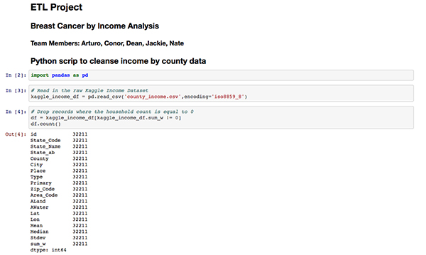

# Data ETL project - Health analytics comparison of cancer survivle rate vs income:

Data analytics proposal and hypothesis developed for exploring Kaggle, opensource health databases and APIs. Data was exracted and cleaned using Excel VBA & Pivot tables, and Jupyter Notebook (with pandas). Numpy and Plotly were used for aggregation and statistical analysis. A word document and powerpoint presentation of finds were submitted and presented to an audience of fell peers and data analyst.
